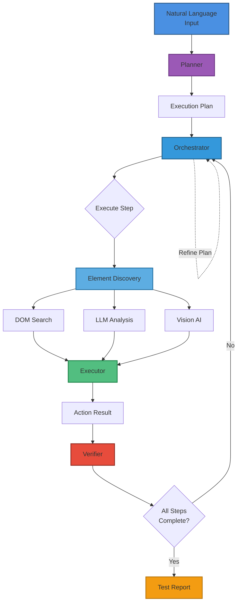

# CUALA (Computer-Using Automation Layer Agent)

[](https://github.com/NaorHai/CUALA/actions/workflows/ci.yml)
[](LICENSE)
[](https://github.com/NaorHai/CUALA/releases)
[](https://nodejs.org)

**Version:** 0.3.0
**Status:** Production-Ready Core + MCP Integration + Multi-LLM Support

CUALA is a high-performance, deterministic browser automation system designed to execute natural-language test scenarios. Unlike traditional automation tools, CUALA combines the speed of DOM-based execution with the power of a vision-based "Computer-Using Agent" to handle complex, visually-rendered, or obfuscated web applications.

## 🤖 Claude Integration via MCP

**NEW**: CUALA now includes a Model Context Protocol (MCP) server that allows Claude Desktop to control browser automation directly!

- **19 Tools** for test execution, plan management, and configuration
- **3 Resources** for viewing executions, plans, and settings
- **Natural Language Testing** - Just tell Claude what to test

👉 **[Get Started with Claude Integration](mcp-server/CLAUDE_SETUP.md)**

---

## 🏗 Architecture

CUALA is built on SOLID principles, ensuring a clean separation of concerns and a modular design that is easy to extend and debug.



### Key Components

#### 1. **Adaptive Planner**
- Generates initial execution plans from natural language scenarios
- Wraps base planner with adaptive capabilities
- Creates plans with `phase: 'initial'` and tracks refinement history

#### 2. **Adaptive Execution Orchestrator**
- **Intelligent Refinement**: Uses a strategy-based refinement system to continuously improve plans during execution
- **Multi-Stage Refinement**: Refines plans at multiple points:
  - After navigation (initial DOM inspection)
  - Before low-confidence steps (proactive)
  - After page changes (SPA/multi-page flows)
  - After step failures (recovery)
  - Based on confidence thresholds
- **Plan Persistence**: Stores all plan phases (initial, refined, adaptive) for analysis and learning

#### 3. **Refinement Strategy System**
Five intelligent strategies work together:
- **Navigation Strategy** (Priority: 100): Refines after first navigation
- **Page Change Strategy** (Priority: 90): Refines when URL changes
- **Failure Strategy** (Priority: 95): Refines after step failures
- **Confidence Strategy** (Priority: 80): Refines low-confidence steps
- **Proactive Strategy** (Priority: 70): Validates selectors before execution

#### 4. **Unified Executor**
- **DOM-First Approach**: Always tries DOM selectors first (faster, more reliable)
- **Vision Fallback**: Automatically falls back to vision AI when DOM fails
- **Element Discovery**: Uses multi-strategy element discovery (Intelligent DOM Search + LLM DOM Analysis + Vision AI)
- **Selector Tracking**: Records the final selector used for each step in execution results
- **DOM-Based Verification**: Uses DOM checks instead of screenshot analysis for reliable verification

#### 5. **Element Discovery Service**
- **Multi-Strategy**: Combines multiple discovery strategies
- **Intelligent DOM Search**: Probability-based search that scores all DOM elements by match likelihood
  - Searches all relevant elements (buttons, inputs, links, tabs)
  - Scores by text content, title, aria-label, ID, name, class, and semantic match
  - Returns highest-probability matches with confidence scores
- **LLM DOM Analysis**: Uses LLM to analyze DOM structure and find selectors
- **Vision AI (Hybrid)**: Uses screenshots for visual context but extracts DOM selectors for execution
- **Confidence Scoring**: Provides confidence scores for discovered elements
- **Flexible Matching**: No hardcoded patterns - adapts to any DOM structure

#### 6. **Plan Phases**
Plans progress through phases:
- `initial`: Generated from natural language
- `refined`: Refined after DOM inspection
- `adaptive`: Adapted during execution failures

#### 7. **Intelligent Element Discovery**
- **Probability-Based Search**: Searches entire DOM and scores elements by match probability
- **Multiple Criteria Scoring**: 
  - Text content match (exact: +50, partial: +40, word overlap: +10 per match)
  - Title attribute match (exact: +45, partial: +35)
  - Aria-label match (exact: +40, partial: +30)
  - ID/name match (+25 per term)
  - Semantic match (tag type matches action: +20)
  - Class name match (+15 per term)
  - Visibility bonus (+10 for visible elements)
- **Flexible Matching**: Works with any DOM structure without hardcoded patterns
- **Selector Recording**: The final selector used is recorded in each step result for debugging and transparency

#### 8. **Verification System**
- **DOM-Based Checks**: Verifies element presence using DOM queries, not screenshots
- **Multiple Element Support**: Handles verification of multiple elements (e.g., "verify presence of 'X' and 'Y' tabs")
- **Intelligent Discovery**: Uses element discovery when selectors fail
- **Trust DOM Results**: AI verifier trusts successful DOM-based verification results

---

## 🚀 Getting Started

### Prerequisites
- Node.js (v18+)
- Playwright browsers
- LLM Provider API Key:
  - **OpenAI** API Key (for GPT-4o, GPT-4o-mini models), OR
  - **Anthropic** API Key (for Claude 3.5 Sonnet, Claude 3.5 Haiku models)

### Installation
```bash
# Navigate to the server directory
cd server

# Install dependencies
npm install

# Install Playwright browsers
npx playwright install chromium
```

### Configuration
Create a `.env` file in the `server/` directory:

```env
# =============================================================================
# LLM Provider Selection
# =============================================================================
LLM_PROVIDER=openai  # Options: 'openai' or 'anthropic'

# -----------------------------------------------------------------------------
# OpenAI Configuration (if LLM_PROVIDER=openai)
# -----------------------------------------------------------------------------
OPENAI_API_KEY=your_openai_key_here
OPENAI_MODEL=gpt-4o                    # Default model
OPENAI_VISION_MODEL=gpt-4o             # Vision model
OPENAI_PLANNER_MODEL=gpt-4o-mini       # Planning model (cheaper/faster)

# -----------------------------------------------------------------------------
# Anthropic Configuration (if LLM_PROVIDER=anthropic)
# -----------------------------------------------------------------------------
ANTHROPIC_API_KEY=your_anthropic_key_here
ANTHROPIC_MODEL=claude-3-5-sonnet-20241022           # Default model
ANTHROPIC_VISION_MODEL=claude-3-5-sonnet-20241022    # Vision model
ANTHROPIC_PLANNER_MODEL=claude-3-5-haiku-20241022    # Planning model (cheaper/faster)

# Optional - Refinement Configuration
MAX_RETRIES=2                    # Maximum retry attempts for failed steps
CONFIDENCE_THRESHOLD=0.6         # Confidence threshold for refinement (0-1)
PROACTIVE_REFINEMENT=true        # Enable proactive refinement before execution

# Optional - Execution Configuration
LOG_LEVEL=info                   # Log level: debug, info, warn, error
HEADLESS=true                    # Run browser in headless mode

# Optional - Storage Configuration
STORAGE_TYPE=memory              # Storage backend: 'memory' or 'redis' (default: 'memory')
REDIS_URL=redis://localhost:6379 # Redis connection URL (required if STORAGE_TYPE=redis)

# Optional - Safety Configuration
SKIP_SAFETY_CHECK=false          # Skip safety checks to avoid rate limits (default: false)
                                 # Set to 'true' to disable OpenAI moderation API calls
                                 # Note: Safety check only available with OpenAI provider
```

### LLM Provider Support

CUALA supports multiple LLM providers for maximum flexibility:

#### OpenAI (GPT-4)
- **Models**: GPT-4o, GPT-4o-mini, GPT-4-turbo
- **Features**: Native JSON mode, vision support, moderation API
- **Use case**: Excellent all-around performance with strong vision capabilities
- **Cost**: Moderate to high

#### Anthropic Claude
- **Models**: Claude 3.5 Sonnet, Claude 3.5 Haiku, Claude 3 Opus
- **Features**: Vision support, long context windows, strong reasoning
- **Use case**: Superior reasoning for complex scenarios, cost-effective Haiku model
- **Cost**: Competitive pricing, especially with Haiku

#### Switching Providers

Simply set `LLM_PROVIDER` in your `.env` file:

```env
# Use OpenAI
LLM_PROVIDER=openai
OPENAI_API_KEY=your_key_here

# Or use Anthropic
LLM_PROVIDER=anthropic
ANTHROPIC_API_KEY=your_key_here
```

**Note**: Safety checking (moderation API) is only available when using OpenAI provider.
```

### Redis Setup (Optional)

CUALA supports Redis as a persistent storage backend. To use Redis:

1. **Start Redis using Docker:**
   ```bash
   docker-compose up -d redis
   ```

2. **Configure your `.env` file:**
   ```env
   STORAGE_TYPE=redis
   REDIS_URL=redis://localhost:6379
   ```

3. **Restart the API server:**
   ```bash
   npm run start-api
   ```

The Redis storage implementation supports all the same operations as in-memory storage:
- Execution state management
- Plan persistence
- Scenario history tracking
- All query operations

**Note:** If Redis is not available when `STORAGE_TYPE=redis`, the server will fail to start. Make sure Redis is running before starting the server.

---

## 🛠 API Usage

CUALA exposes both a programmatic TypeScript API and a REST API for the UI.

### REST API
The server includes an Express-based REST API.

**Start the API Server:**
```bash
cd server
npm run start-api
```

**Trigger a test:**
- **URL**: `POST http://localhost:3001/api/execute`
- **Body**:
```json
{
  "scenario": "Navigate to https://example.com and check the heading",
  "failFast": true
}
```
- **Response**: Includes `steps` array with `stepId`, `description`, `selector`, `status`, `verification`, and `snapshot` for each step

**Async Execution:**
- **URL**: `POST http://localhost:3001/api/execute-async`
- **Body**:
```json
{
  "scenario": "Navigate to https://example.com and check the heading",
  "failFast": true
}
```
- Returns `testId` immediately, poll `/api/get-status/:testId` for progress

**Generate Plan (Dry Run):**
- **URL**: `POST http://localhost:3001/api/plan`
- **Body**:
```json
{
  "scenario": "Navigate to https://example.com and check the heading"
}
```
- Returns plan without execution

**Update Plan:**
- **URL**: `PUT http://localhost:3001/api/plans/:planId`
- **Body**:
```json
{
  "name": "Updated Plan Name",
  "steps": [...],
  "phase": "refined",
  "refinementHistory": [...]
}
```
- Updates any plan fields (name, steps, phase, refinementHistory)
- Note: `id` and `scenarioId` cannot be changed

**Delete Plan:**
- **URL**: `DELETE http://localhost:3001/api/plans/:planId`
- Deletes a plan by plan ID

**List All Plans:**
- **URL**: `GET http://localhost:3001/api/list-plans`
- Returns all execution plans

### Programmatic API
```typescript
import { runScenario, runScenarioAsync, generatePlan } from './index.js';

// Synchronous execution
const result = await runScenario('My test description', true);

// Asynchronous execution
const testId = await storage.createExecution('My test description');
await runScenarioAsync(testId, 'My test description', storage, true);

// Generate plan only (dry run)
const plan = await generatePlan('My test description', storage);
```

> **Note**: The system automatically chooses between DOM and Vision execution - no `executionMode` parameter needed!

---

## 📊 Reporting & Logs
CUALA produces deterministic, human-readable reports to `stdout` and detailed JSON logs.

- `cuala.log`: Full trace of the AI's reasoning, execution timings, snapshots, and refinement decisions.
- **Step Details**: Each step in the API response includes:
  - `description`: Natural language description of the step
  - `selector`: Final CSS selector that was used for execution (if applicable)
  - `status`: Execution status (success/failure/error)
  - `verification`: Verification results (if applicable)
  - `snapshot`: Screenshot and DOM metadata
- **Multiple Element Verification**: When verifying multiple elements, they are split into separate steps for clearer error reporting

### Plan History
All plans are persisted with their phases:
- **Initial Plans**: Generated from natural language
- **Refined Plans**: Improved after DOM inspection
- **Adaptive Plans**: Adapted during execution failures

Query plan history via:
- `GET /api/get-plan/:planId` - Get specific plan
- `PUT /api/plans/:planId` - Update plan
- `DELETE /api/plans/:planId` - Delete plan
- `GET /api/list-plans` - List all plans
- `GET /api/get-latest/:scenarioId` - Get latest execution for scenario
- `GET /api/get-history/:scenarioId` - Get all executions for scenario

---

## 🔒 Security & Isolation
CUALA is designed for production environments:
- **Sandboxed Sessions**: Every run uses a fresh `BrowserContext`.
- **Zero Persistence**: No credentials, cookies, or local storage persist between executions.
- **Ephemerality**: Automatic cleanup of all browser instances via `finally` blocks.

## 🎯 Key Features

### Intelligent Element Discovery
- **Probability-Based Search**: Searches all DOM elements and scores by match probability
- **No Hardcoded Patterns**: Adapts to any DOM structure without assumptions
- **Multiple Scoring Criteria**: Text, title, aria-label, ID, name, class, semantic match
- **Flexible Matching**: Finds elements even when structure varies

### Smart Verification
- **DOM-Based Checks**: Uses DOM queries instead of screenshot analysis for reliability
- **Multiple Element Support**: Handles verification of multiple elements intelligently
- **Trust DOM Results**: AI verifier trusts successful DOM-based verification

### Adaptive Planning
- **Incremental Refinement**: Refines only the next step after successful execution (more efficient)
- **Multiple Element Splitting**: Planner automatically splits multiple element verifications into separate steps
- **Intelligent Recovery**: Adapts plans when elements aren't found or steps fail

### Execution Transparency
- **Selector Visibility**: Each step result includes the final CSS selector that was used, making it easy to debug and understand what elements were targeted
- **Step Descriptions**: Natural language descriptions for each step provide clear context
- **Comprehensive Snapshots**: Screenshots and DOM metadata captured for every step
